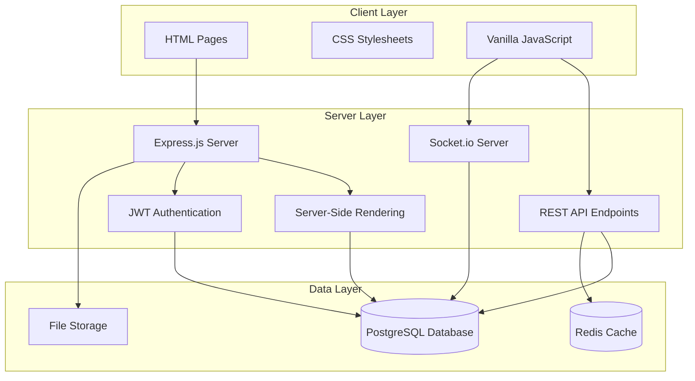

# Design Document: HTML/CSS/JS + Express.js Migration

## Overview

This document outlines the technical design for migrating a social media application from a React/TypeScript/Supabase stack to a vanilla HTML/CSS/JavaScript frontend with Express.js backend. The current application features posts, comments, likes, messages, notifications, user profiles, hashtags, and search functionality with real-time updates. The migration will preserve all existing features while transitioning to a simpler, framework-free architecture that maintains scalability and performance.

The target architecture uses server-rendered HTML pages with progressive enhancement via vanilla JavaScript, Express.js for the backend API and server-side rendering, PostgreSQL for the database, JWT-based authentication, and Socket.io for real-time features. This approach reduces build complexity, eliminates framework dependencies, and provides a more straightforward development experience while maintaining feature parity with the existing application.

## Architecture



## Main Workflow: User Authentication Flow

```mermaid
sequenceDiagram
    participant Browser
    participant Express
    participant Auth
    participant Database
    participant Session
    
    Browser->>Express: POST /auth/login (email, password)
    Express->>Auth: validateCredentials(email, password)
    Auth->>Database: SELECT user WHERE email = ?
    Database-->>Auth: user record
    Auth->>Auth: bcrypt.compare(password, hash)
    Auth->>Auth: generateJWT(userId)
    Auth-->>Express: JWT token
    Express->>Session: storeSession(userId, token)
    Express-->>Browser: Set-Cookie: token; Redirect to /home
    Browser->>Express: GET /home (with cookie)
    Express->>Auth: verifyJWT(token)
    Auth-->>Express: userId
    Express->>Database: SELECT user, posts, follows
    Database-->>Express: user data
    Express->>Express: renderHomePage(data)
    Express-->>Browser: HTML page with user feed
